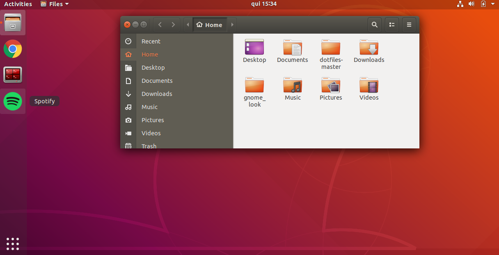
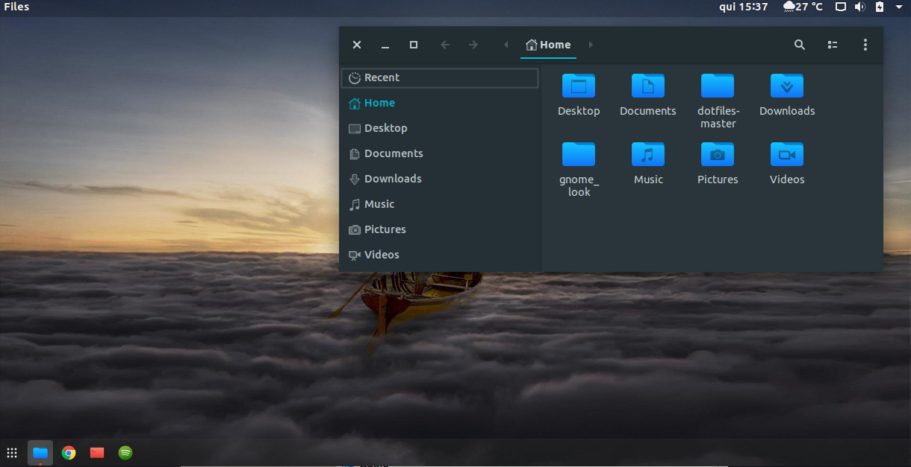

# GNOME Look

<p align="center">
  <a href="https://github.com/linux-ricing-project/ubuntu_install">
    
  </a>
  
</p>

<p align="center">
  <a href="https://img.shields.io/badge/ubuntu-18.04-E95420.svg">
    
  </a>
  <a href="https://img.shields.io/badge/ubuntu-19.04-77216F.svg">
    
  </a>
  <a href="https://img.shields.io/badge/language-shell-43A047.svg">
    
  </a>
</p>

Script to customize GNOME with my visual preferences (themes + icon themes + extensions and so on)

# Description

This script is recommended to run after [ubuntu_install](https://github.com/linux-ricing-project/ubuntu_install) (that make the initial configs). It works the following way:

Each customization have a name in reference a Pernambuco cities names, like 'Caruaru', 'Recife', 'Olinda' and so on.

**It is don't have any visual similar with this cities, is just to name them.**

There are currently 2 themes:
- **Reset Theme**: This theme reset all Ubuntu initial configs

- **Caruaru Theme**: the first customization

**Install Folders:**  
Extensions: ```$HOME/.local/share/gnome-shell/extensions```  
Icons: ```$HOME/.local/share/icons/```

## Reset Theme

### To use:
```bash
./gnome_look --reset
```
### Features:
- disable all extensions
- reset gnome configs (with the initial values)
- delete icons folder (`$HOME/.local/share/icons/`)
- delete extensions folder (`$HOME/.local/share/gnome-shell/extensions`)

### Example:




This image show the default **Ubuntu 18.04** with my default initial config (after running [ubuntu_install](https://github.com/linux-ricing-project/ubuntu_install)).

## Caruaru Theme

### To use:
```bash
./gnome_look --caruaru
```

### Features:

**Base Configs:**

Configs:
- show all hidden startup applications
- uninstall `gnome-software` (so, i really don't use)
- disable `gnome-welcome` to boot
- set to 'do nothing' when laptop lid was closed
- disable desktop icons (home folder, network folder, trash folder....)
- change control buttons to the left position

Extensions:
- [Unite](https://github.com/hardpixel/unite-shell)
- [OpenWeather](https://extensions.gnome.org/extension/750/openweather/)

**Theme Configs:**

  Configs:
  - set Dash position to BOTTOM
  - change Dash icon size to 20
  - change 'show apps' button to the left
  - set my favorite-apps in Dash
  - set wallpaper and lock screen (with blur effect)

  Theme:
  - [Adapta](https://github.com/adapta-project/adapta-gtk-theme)

  Icons:
  - [Korla](https://github.com/bikass/korla)
  - [Korla Folders](https://github.com/bikass/korla-folders)


### Example:




This image show the **Ubuntu 18.04** after run 'Caruaru Theme'.
