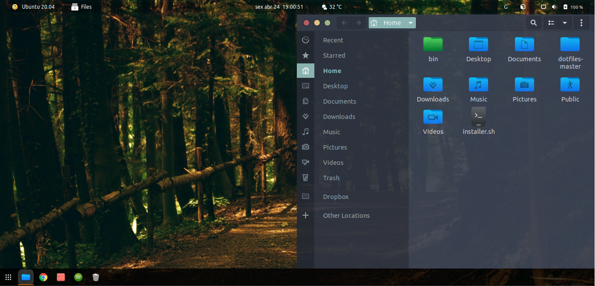

# Ubuntu-Gnome

<p align="center">
  <a href="https://github.com/linux-ricing-project/ubuntu_install">
    
  </a>
  
</p>

<p align="center">
  <a href="https://img.shields.io/badge/ubuntu-20.04-4A0048.svg">
    
  </a>
  <a href="https://img.shields.io/badge/ubuntu-18.04-E95420.svg">
    
  </a>
  <a href="https://img.shields.io/badge/language-shell-43A047.svg">
    
  </a>
</p>

# Description

Project to customize GNOME with my visual preferences (themes + icon themes + visual preferences and so on).

This project is recommended to run after [ubuntu_install](https://github.com/linux-ricing-project/ubuntu_install) (that make the initial configs).

**Install Folders:**
| Type | Folder |
| ------ | ------ |
| Extensions | `$HOME/.local/share/gnome-shell/extensions` |
| Icons | `$HOME/.local/share/icons/` |
| Themes | `/usr/share/themes` |

In this repository have some scripts:

## 1. `install_extensions.sh`
This script install Gnome extensions that i use:
- [Dash-to-Dock](https://extensions.gnome.org/extension/307/dash-to-dock/)
- [Blyr](https://extensions.gnome.org/extension/1251/blyr/)
- [Apt-Update-Indicator](https://extensions.gnome.org/extension/1139/apt-update-indicator/)
- [Activities-Configurator](https://extensions.gnome.org/extension/358/activities-configurator/)
- [Glassy-Gnome](https://extensions.gnome.org/extension/982/glassy-gnome/)
- [OpenWeather](https://extensions.gnome.org/extension/750/openweather/)
- [User-Theme](https://extensions.gnome.org/extension/19/user-themes/)

**OBS:** After run `install_extensions.sh` in Ubuntu 20.04, is necessary make log-out and when log-in again, restart the Gnome with:
```
ALT + F2
r
```

## 2. `install_preferences.sh`
This script apply some config Gnome preferences that i use:
- show all hidden startup applications
- **uninstall `gnome-software` (so, i really don't use)**
- disable `gnome-welcome` to boot
- set to 'do nothing' when laptop lid was closed
- apply my gnome shortcuts*
- disable desktop icons (home folder, network folder, trash folder....)
- change control buttons to the left position
- set favorite-app in Dash
- set clock configs (show seconds and show date)
- apply file manager bookmarks
- set [wallpaper](https://github.com/linux-ricing-project/Ubuntu-Gnome/blob/master/wallpaper/wallpaper.jpg) and lock-screen
- set GDM profile picture
- [OpenWeather] Unit: celsius
- [OpenWeather] wind-speed-unit: kph
- [Apt-Update-Indicator] update-cmd-options: update-manager
- [Dash-to-Dock] background-color "#000000"
- [Dash-to-Dock] custom-theme-running-dots-border-color "#CE5C00"
- [Dash-to-Dock] icon-size 20
- [Dash-to-Dock] always visible
- [Dash-to-Dock] set to BOTTOM
- [Dash-to-Dock] set "show-apps" to the left position
- [Activities-Configurator] change icon to ubuntu-logo
- [Activities-Configurator] change text to ubuntu-version

***Shortcuts:**
| Command | Shortcut |
| ------ | ------ |
| Nautilus | `<Super> + E`

## 3. `install_themes_and_icons.sh`
This script install and apply my Gnome customizations:
### Ubuntu 20.04 installation
| Theme | Name | Apply |
| ------ | ------ | ------ |
| GTK | [Nordic](https://github.com/EliverLara/Nordic) | YES
| Gnome-Shell | [Flat-Remix](https://github.com/daniruiz/flat-remix-gnome) | YES
| Icons | [Korla](https://github.com/bikass/korla) + [Korla Folders](https://github.com/bikass/korla-folders) | YES
| Cursor | [Breeze](https://www.gnome-look.org/p/999991/) | YES

### Ubuntu 18.04 installation
| Theme | Name | Apply |
| ------ | ------ | ------ |
| GTK | [Arc-Dark](https://github.com/horst3180/arc-theme) | YES
| Gnome-Shell | [Arc-Dark](https://github.com/horst3180/arc-theme) | YES
| Icons | [Korla](https://github.com/bikass/korla) + [Korla Folders](https://github.com/bikass/korla-folders) | YES
| Cursor | [Breeze](https://www.gnome-look.org/p/999991/) | YES

### Example:



This image show the **Ubuntu 20.04** after run all scripts.


GDM profile picture


This image show the **Ubuntu 18.04** after run all scripts.

----

  ### License:

[Creative Commons 4.0](LICENSE)

<p align="left">
  <a rel="license" href="http://creativecommons.org/licenses/by-nc-sa/4.0/">
     </a>
  <a href="http://creativecommons.org/licenses/by-nc-sa/4.0/">
    
  </a>
</p>
