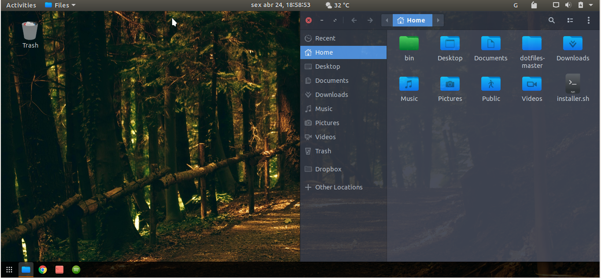

# Ubuntu-Gnome

  
  

  
  
  

# Description

Project to customize GNOME with my visual preferences (themes + icon themes + visual preferences and so on).

This project is recommended to run after [ubuntu_install](https://github.com/linux-ricing-project/ubuntu_install) (that make the initial configs).

**Install Folders:**
| Type | Folder |
| ------ | ------ |
| Extensions | `$HOME/.local/share/gnome-shell/extensions` |
| Icons | `$HOME/.local/share/icons/` |
| Themes | `/usr/share/themes` |

In this repository have some scripts:

## 1. `install_extensions.sh`
This script install Gnome extensions that i use:
- [Blyr](https://extensions.gnome.org/extension/1251/blyr/)
- [Apt-Update-Indicator](https://extensions.gnome.org/extension/1139/apt-update-indicator/)
- [Glassy-Gnome](https://extensions.gnome.org/extension/982/glassy-gnome/)
- [OpenWeather](https://extensions.gnome.org/extension/750/openweather/)
- [User-Theme](https://extensions.gnome.org/extension/19/user-themes/)

And apply some configs:
- OpenWeather Unit: celsius
- OpenWeather wind-speed-unit: kph
- Apt-Update-Indicator update-cmd-options: update-manager
- Set Dash position do BOTTOM
- Change Dash icon size to 20
- Change 'show apps' button to the left

## 2. `install_preferences.sh`
This script apply some config Gnome preferences that i use:
- show all hidden startup applications
- uninstall `gnome-software` (so, i really don't use)
- disable `gnome-welcome` to boot
- set to 'do nothing' when laptop lid was closed
- disable desktop icons (home folder, network folder, trash folder....)
- change control buttons to the left position
- set favorite-app in Dash
- set clock configs (show seconds and show date)
- set [wallpaper](https://github.com/linux-ricing-project/Ubuntu-Gnome/blob/master/wallpaper/wallpaper.jpg) and lock-screen

## 3. `install_themes_and_icons.sh`
This script install and apply my Gnome customizations:
| Theme | Name | Apply |
| ------ | ------ | ------ |
| GTK | [Arc-Dark](https://github.com/horst3180/arc-theme) | YES
| Gnome-Shell | [Arc-Dark](https://github.com/horst3180/arc-theme) | YES
| Icons | [Korla](https://github.com/bikass/korla) + [Korla Folders](https://github.com/bikass/korla-folders) | YES
| Cursor | [Breeze](https://www.gnome-look.org/p/999991/) | YES

### Example:

This image show the **Ubuntu 18.04** after run all scripts.
